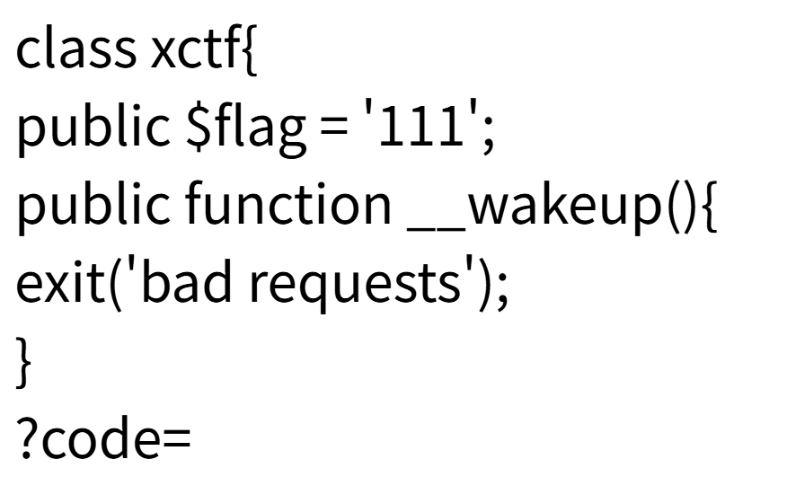
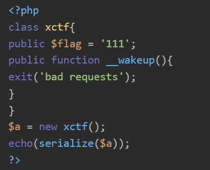

【攻防世界】web新手题 unserialize3

我的解题过程：

1、刚开始看到这个页面，

哇哦，一串代码，拥有一点编程思想的我，能看出这个程序php代码有缺陷，少了括号，并不完整，但是呢，我也仅限于此了，因为我是小白啊，无从下手，后面查阅了一下，这是个有关反序列化的题，纯小白，压根不懂怎么做，但是呢既然做到这种题了，那就必须把它搞懂并且记录到小本本上。

2、开始翻阅WriteUP和题解过程以及序列化基本原理，前前后后大概两小时后，大概知道序列化是什么了。[攻防世界： WEB——unserialize3 - Zeker62 - 博客园](https://www.cnblogs.com/Zeker62/p/15176752.html)

3、这个解题方向就是要你构造反序列化，来获取flag

如何构造？

__wakeup()属于魔术方法，通常用于反序列化中，这个代码肯定是有问题的，所以我们需要构造序列化，补全php代码，

### `$a = new xctf();`：创建一个xctf的对象这个对象有一个属性flag，值为”111“

输出的结果是：0:4:"xctf":1:{s:4:"flag";s:3:"111";}

这是个啥呢？我来解释一下：

0：Object（对象）

4：代表类名长度

“xctf":类名

1：对象有一个属性

s:4:"flag"=string类型，长度4，属性名：flag

s:3:"111"=string类型，长度3，属性值：111

虽然输出了序列化的结果，但是我们需要构造反序列化

为什么需要？

为了构造出来的序列化不能给__wakeup()执行，否则会返回bad request，所以我们需要在序列化参数做些修改

怎么修改？

如果我们在序列化中说明的对象个数要比实际的参数个数要大，那么将不会执行__wakeup()这个方法，所以，我们将序列化的对象属性个数改成大于1的个数就好了

比如：?code=O:4:"xctf":3:{s:4:"flag";s:3:"111";}

4、总结

这是我第一次遇到反序列化的题，也是我第一次接触到，看起来是复杂，特别是构造反序列化，那个结果如果没有了解过序列化的话，都不知道这是个啥O:4:"xctf":3:{s:4:"flag";s:3:"111";}，代表的含义又是什么，但是呢，任何事物，只要透过现象看本质，就会发现并没有那么的复杂，更多的是要去理解它。